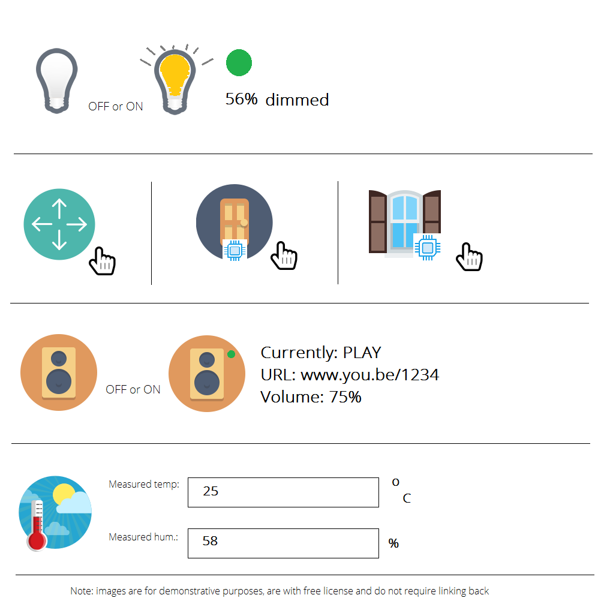

# Smart Device Control System

## 1. Overview

It is assumed that we, as developers, are in the following situation: on one hand, we have a control unit (e.g. Raspberry Pi 3) which is physically connected to the following devices:

- A color LED bulb – can be switched on or off and respective dimming percent and color (hex value) can be set; 
- A motion sensor – triggered when there is motion detected; 
- A door open/close contact – triggered when a door is opened; 
- A window open/close contact – triggered when a window is opened;
- A wireless sound speaker – can play/pause/stop a given song (via URL) and be set with a volume level; 
- An internal temperature/humidity sensor – can retrieve the current temperature and show a humidity percent. 

Furthermore, there already is a script running on the Raspberry Pi, which does the following: 

- For the bulb and speaker, constantly pings a remote endpoint (in the cloud) and gets what command is required to be sent to these two devices (e.g. light up in red at 50% or play a given song at volume 25%); 

- For the motion sensor, door and window contacts and the temperature sensor, constantly sends the read values to another endpoint in the same cloud (i.e. the cloud is always updated with the latest values, for example window opened at 5:15 PM). 

In other words, the Raspberry is programmed to send all the data read from all connected sensors to the cloud storage and read/apply all commands read from the cloud storage to all connected actuators. We do not, however, care about the code running on the Raspberry! 

### What we are going to develop, on the other hand, is the system which, via UI, updates and reads the data in the cloud storage and displays all the data that the sensors have read, as well as sends commands to be applied on the speaker and the bulb.

## 2. General specification of the different system components

### The system should be constructed of the following parts (prioritized from top to bottom): 

    a. (back - end) Java framework that incorporates the different
     types of devices in such a manner so that a new device can easily be integrated. 

    b. (back - end) Java logic for DB connection, as well as
     inserting/retrieving the device data to/from a database (MySQL). 

    c. (back - end) Java servlet implementation (to establish connection with the UI)

    d. (front - end) User interface based on Angular JS (would be better to use Angular 2) 
    and Bootstrap, which displays all the data from the sensors, 
    as well as provides the user with the capability to send
    commands to the bulb and the speaker. 

## 3. Detailed information about the different system components 
    a. Java framework – essentially, the framework should act as a skeleton 
    for devices, representing them in an OOP way. In general, every device 
    (or, let us call it, a “thing”) should have the following properties: 

        - Manufacturer (e.g. Philips) 

        - Model ID (e.g. HUE Go) 

        - Serial number (e.g. ABC123)

        - Firmware version (e.g. 2.5.1) 

        - Hardware version (we assume that new versions of the same 
          model just increase the version number with 1, so versions here
          will be 1,2,3, etc.) 

        - Label (internal name of the thing given by the user)

### For every device, all fields should be able for retrieval and modification. 

Furthermore, there are devices that can do more than one action – for 
example, the motion sensor can only state it is triggered or not, but the 
speaker can play/stop/pause a song and set the volume. So, each thing 
should have a list of respective “abilities” called “channels”. The motion 
sensor, on one hand, should have only one trigger channel, while the 
speaker can have two channels – one for the play control and one for the 
volume setup. 

### For every device, all channels should be able for retrieval only. 

A channel, however, can be shared between many things (e.g. a trigger channel is available and utilized for the motion sensor, the door and the window contact). Every channel should have a list of accepted commands, e.g.: 

- The trigger channel should only accept ON or OFF commands 
- The volume channel should only accept a PERCENT command
- The song control channel should only accept PLAY, PAUSE, STOP commands 
- The song URL channel should only accept a STRING command 
- The dimming channel should only accept a PERCENT command 
- Etc...

Every channel should have a state. For example, at a given moment the trigger channel could be in ON state, while in a few minutes it can go in an OFF state. 

### For every channel, the accepted command types should be able for retrieval, while the state should be able for retrieval and modification. 

In general: 1 thing <--> n channels <--> n command types, where every channel’s state can be updated separately. 

    b. DB structure – here it is important that all the thing data
     (manufacturer, model, etc.), and all supported channels for a thing will
      be predefined in the DB. However, all possible commands for a given 
      channel type will be only retrieved from the framework (during runtime).

    c. UI – the user interface should give the user the opportunity to 
    constantly monitor the states of all sensors, as well as when they were 
    last triggered. Furthermore, the user should have the ability to input a URL for a 
    song to be played, control the player and set its volume. 
    Finally, the user should be able to set the bulb to on or off, as 
    well as set its color and dimming percentage

## 4. Additional system components

Additionally, a device simulator should be present in the system to serve as a real device substituent. It should have a UI which illustrates the following devices with their corresponding functionalities:

1. *A light bulb* - depicted by two images (bulb that is lit up and bulb that is switched off), with additional indicator for the color (e.g. a circle which is colored in the corresponding HEX color value) and dimmer percent value indicator (as text).
2. *A motion sensor* - depicted by an image of a motion sensor. When there is a click event on the motion sensor (the image should be put in an anchor tag so that the default pointer is changed for better usability on hover), this would be counted as a simulated sensor trigger.
3. *A door open/close contac*t - depicted by an appropriate image (to be discussed) with the same logic as the motion sensor.
4. *A window open/close contact* - same as for the door open/close contact.
5. *A wireless sound speaker* - depicted by a speaker image. As for the bulb, we should display if it is on or off, show its volume level (as text), show the URL of the currently played song (as text), show the currently applied command (e.g. play/stop/etc. as text).
6. *An internal temperature and humidity sensor* - depicted by a simple thermometer icon with input text fields for the temperature and humidity values to simulate readings.

>Below is a sample scheme of what the simulator should provide (image is illustrative):

## Setup running environment

### For angular:

Dependencies: NODEjs (npm), Angular2
1. Install Angular2 from node: npm install -g @angular/cli
2. Install package dependencies: cd sdcs-site; npm install
3. Start angular: ng serve

### For framework DB connection:

Go to db_resources and change db.properties to correspond to your DB user and password.
SQL build script and DB schema are provided.